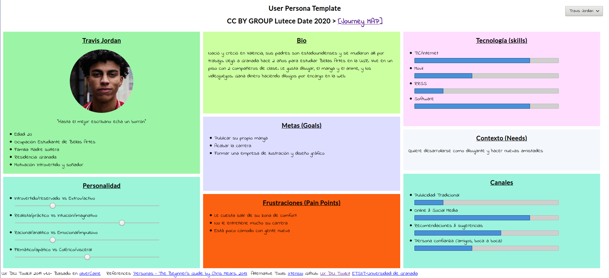
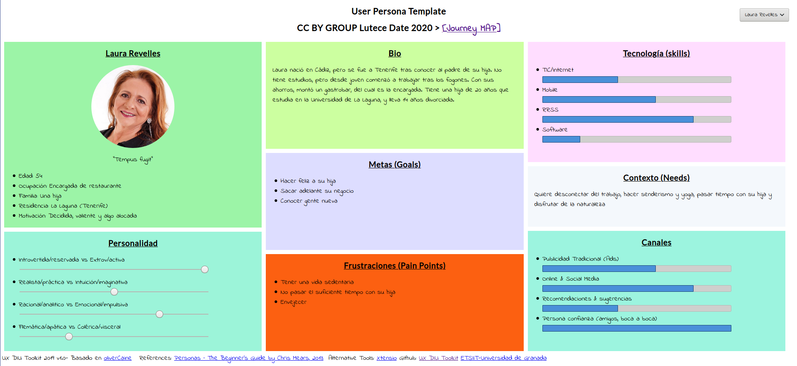
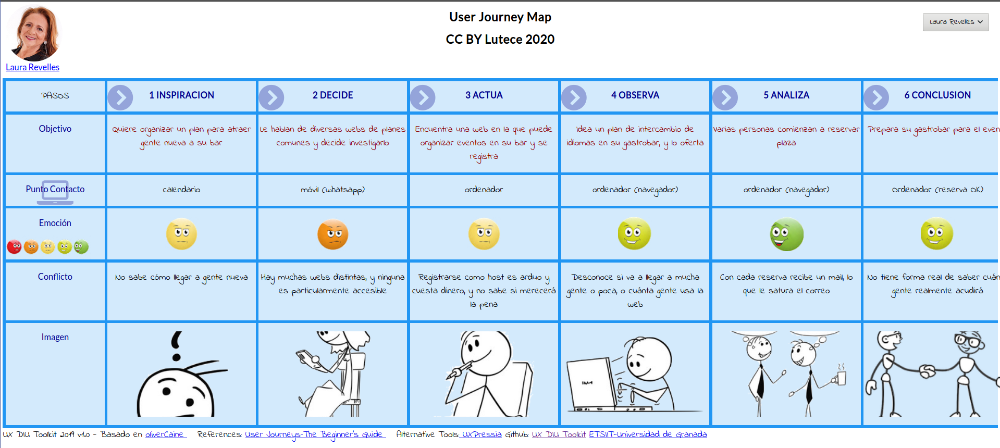

## DIU - Practica1, entregables

- Desk research: Análisis Competencia 
- 2 Personas 
- 2 User Journey Map  (1 por persona)
- Revisión de Usabilidad 

# Proceso de Diseño 

## Paso 1. UX Desk Research & Analisis 

 1.a Competitive Analysis
-----

Se ha estudiado el caso de MeetUp, EatWith y Artery. El objetivo común de estas páginas es compartir experiencias de ocio, si bien EatWith se enfoca más en compartir experiencias culinarias y los otros dos son más de variedad (actividades deportivas, de formación, de eventos para compartir experiencias y conocer gente...). Estos eventos suelen estar publicados por el mismo *host* del evento (o en el caso de ***Artery*** el *artista* también) y permiten inscribirse a este, teniendo así una lista de asistentes. Además, cada evento tiene su descripción y una zona resumida que te dice el día, hora, precio (si procede), y localización.
 

 |Características |Artery |MeetUp     |EatWith     |
 |----------------|-------|-----------|------------|
 |  *Formato*            | Web   | Web + App | Web + App  |
 |  *Búsqueda (keywords)*| ✔     | ✔         | ✔          |
 |  *Búsqueda(avanzada)* | ✔     | ✔         | ✔          |
 |  *Creación de eventos*| ✔     | ✔         | ✔          |
 |  ***Visualización de eventos:*** |      |   |           |
 |  *->Opción de eventos gratis*| ✘      | ✔         | ✘          |
 |  *->Opción de eventos de pago*| ✔     | ✔         |        ✔   |
 |  *->Miembros participantes* | ✘     | ✔   |✘          |
 |  *-> Marcar como favorito* | ✘     | ✔   | ✘          |
 |  *-> Mapa de localización* | ✔     | ✔   | ✔          |
 |  *-> Adición de invitados* | ✘      |  ✔   | ✔          |
 |  *Fichas de grupos o individuos*|✔ (Permite contacto con host y con artista)      | ✔(Permite contacto y seguir eventos de este)         | ✔ (Permite reserva directa y contacto)         |
 |  *Centro de ayuda* | ✔     | ✔   | ✔          |
 |  *Contacto por chat online* | ✔     | ✔   | ✔          |
 |  *Versión en español* | ✘     | ✔   | ✔          |
 
La que hemos elegido en nuestro caso es MeetUp ya que las experiencias son variadas, y tiene más características que las demás. Además, es la más accesible y la que más gente usa.

 1.b Persona
-----
 

 1.c User Journey Map
----

 1.d Usability Review
----
[Enlace al Usability Review en Excel](https://github.com/IvanitiX/DIU20/blob/master/P1/Usability-review-template.xlsx)

Una vez hecha la revisión y dada la puntuación, desglosaremos el funcionamiento en los siguientes puntos:

#### Caracteristicas y Funcionalidad

En general, todo está bien. Todo cumple con los flujos de procedimientos, y sus consiguientes metas y objetivos. Las llamadas a la acción son claras y etiquetadas (quitando algún enlace con tonos grises). Lo unico malo es que no se adapta este diseño a personas expertas, haciendo que pase por el mismo flujo que un novato.

#### Página de inicio

El orden de la landing page está bien, pero quizás debería cambiarse algunos elementos del orden, y eliminar otros.

#### Navegación

Es un punto fuerte de la página. Se puede buscar desde los navegadores tradicionales, y tiene una URL sencilla. Las secciones se pueden entender fácilmente (sobre todo si sabes inglés). Quitando eso, cada evento tiene una id, cosa que es entendible ya que dos eventos iguales podrían causar errores en la lógica de la aplicación.

#### Búsqueda

Es un gran punto débil. La búsqueda por keywords va un poco "de aquella manera", es decir, que los resultados varían según le des a buscar con una misma keyword, y es exclusivo de cuentas registradas. La búsqueda avanzada se basa en categorías con algunas etiquetas que no dan el mensaje correctamente, y que hay pocas opciones de filtrado más, si bien son las esenciales. Echaríamos en falta, por ejemplo, el filtrado por precio.

#### Control y feedback

El feedback general está bien, lo unico malo es que no se pueden deshacer acciones con volver atrás. Se debe ir a un botón desaturado y ver las opciones en un desplegable.

#### Formularios

No hay mucho que comentar. La información que piden es relevante y mínima, suficiente para hacer las gestiones.

#### Errores

Estos se definen de forma clara, sin códigos extraños para novatos *(404, 403 Forbidden...)*, sino lo que pasa y qué hacer. Se puede volver atrás o volver a la landing page desde allí.

#### Contenido y texto

Etá bastante bien, pero como se dijo anteriormente, hay etiquetas que no representan bien las categorías; y que no permiten imprimir las cosas correctamente (no hay una página de impresión o si imprimes tal documento todo se descoloca.)

#### Ayuda

MeetUp posee un centro de ayuda tanto para hosts como para asistentes. Además de ello, hay un soporte en línea para que los usuarios hagan cualquier pregunta.

#### Rendimiento

La web responde rápidamente y sin problemas, desde cualquier dispositivo, además de su app. 
