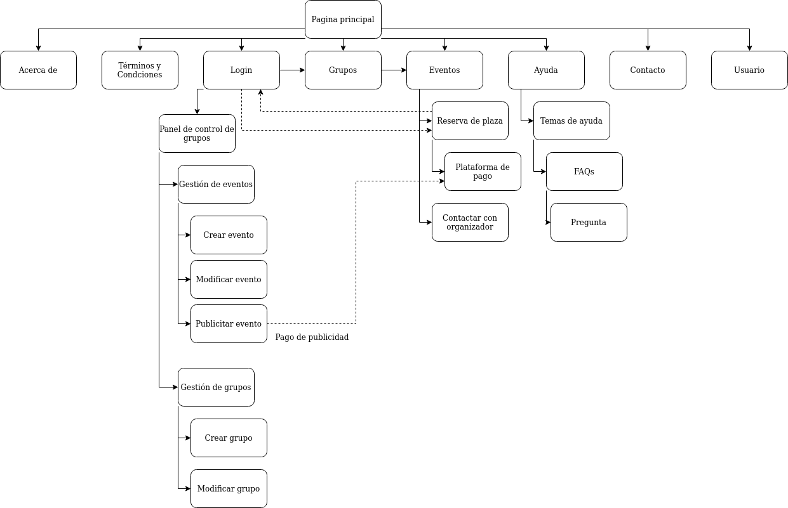

## Paso 2. UX Design  

 2.a Feedback Capture Grid
----

>>> Comenta con un diagrama los aspectos más destacados a modo de conclusion de la práctica anterior,

 Interesante | Críticas     
| ------------- | -------|
| Crear un grupo es bastante fácil (al menos hasta llegar al proceso de pago)| Homepage para usuarios registrados está mal estructurado.|
|Información de eventos a golpe de vista| Búsqueda de eventos pobre y poco amigable.|
|Fácil de encontrar por los buscadores|No hay versión para imprimir tampoco se puede imprimir la página del evento correctamente.|
|  **Preguntas** | **Nuevas ideas**|
|Pagar por publicitar eventos por la página o anuncios de la web.|Usando geolocalización, que se avise de eventos cercanos a la ubicación del usuario|
|Sistema de verificación para no crear eventos “falsos”|Grupo de Whatsapp/Telegram/Otra aplicación de mensajería integrada o externa para coordinación.|
|Sistema de valoración
  
  
  
>>> ¿Que planteas como "propuesta de valor" para un nuevo diseño de aplicación para economia colaborativa ?
>>> Problema e hipótesis
>>> (150-200 caracteres)

 2.b Tasks & Sitemap 
-----

>>> Definir "User Map" y "Task Flow" ... 

 2.c Labelling 
----

>>> Identificar términos para diálogo con usuario  

Término | Significado     
| ------------- | -------
  Login¿?  | acceder a plataforma

 2.d Wireframes
-----

>>> Plantear el  diseño del layout para Web/movil (organización y simulación ) 
