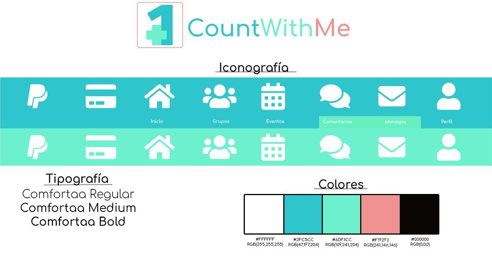

# DIU - Practica 3, entregables

## Análisis de MuseMap   
Al efectuar el análisis nos percatamos de que de que hay ciertas cosas que se han condensado en las prácticas o no se han hecho. En concreto:
La primera parte habla de la introducción, las preguntas y sugerencias que dan paso a la idea de crear la aplicación, que se daría en el enunciado de la práctica 1. Tras ello viene el análisis competitivo, similar a lo que se ha hecho, pero dando énfasis luego en parecidos y cosas a destacar de los candidatos.
Tras hacer entrevistas a ususarios y el *affinity mapping*, pasan a la creación de personas y journey maps (estos de una forma más completa y amplia, mientras que la nuestra es más compacta), de donde sacar hipótesis y escenarios; de donde sacar ideas (que en nuestro caso se pondrían en el Feedback Capture Grid, y en la entrada, en un doble eje).
Después se hace la propuesta de valor y se delimitan las tareas, haciendo ya wireframes y bocetos, cosa que creemos que no tendría sentido sin pasar antes por el sitemap (que hacen con el mockup final) y su correspondiente labelling (que ni siquiera mencionan). Nuestro análisis acaba con el formato para mostrar los estilos, donde quizás podría tener en cuenta los iconos y las metáforas que representarían.

En general, vemos que esta entrada la estructura es similar a la que hacemos de las prácticas, con adiciones como el uso de la Empathy Map, y cambios a los que no le vemos mucho sentido como que el sitemap se haga tras el mockup final, que si bien han hecho previamente una representación de las redirecciones desde cierto punto, quizás debería haberse pensado previamente al bocetado, y tener en cuenta el labelling.

## Propuesta de elementos de diseño o patrones a usar
De cara a pensar en nuestra aplicación, deberíamos intentar sobre todo que sea lo más atractiva y fácil de usar posible, de cara a captar nuevos clientes que puedan estar medianamente interesados. Es por ello que el homepage de un usuario no registrado debería mostrar a un simple vistazo todo lo que puede ofrecer la app, y que invite al propio usuario a comenzar a usarla.
La app pedirá permisos para acceder a la ubicación del usuario, a fin de mostrarle eventos y grupos que estén cerca de él nada más abra la app.
Se habrá de mantener un diseño homogéneo y constante entre las distintas versiones de la app (android y ios), y la versión web.
También se tendrá que marcar claramente la diferencia entre loguearse y registrarse, y para facilitar ambos procesos, hacer uso del desbloqueo por huella.
Por otro lado, hay una gran parte de nuestro diseño inicial que concuerda con las pautas aportadas por Google, como tener una barra de búsqueda destacada, opciones de filtrado y registro de búsquedas, la importancia de las valoraciones, ofrecer opciones de pago externas.

## Historia en Video del UX Case Study

## Documentación. Valoración del equipo sobre la realización de esta práctica o los problemas surgidos
La valoración que hacemos de la práctica es muy positiva. Ha sido una experiencia nueva el ponerse en la piel de un desarrollador que tiene que "vender" su aplicación, su idea. Consideramos que hemos aprendido mucho, con la elección de la paleta de colores, la fuente o el diseño del logo. 
Además, a la hora de grabar el vídeo, nos encontramos con el problema de cómo enfocar la realización del vídeo, para que éste fuera entretenido, y mostrase a la vez nuestro trabajo realizado hasta ahora.
